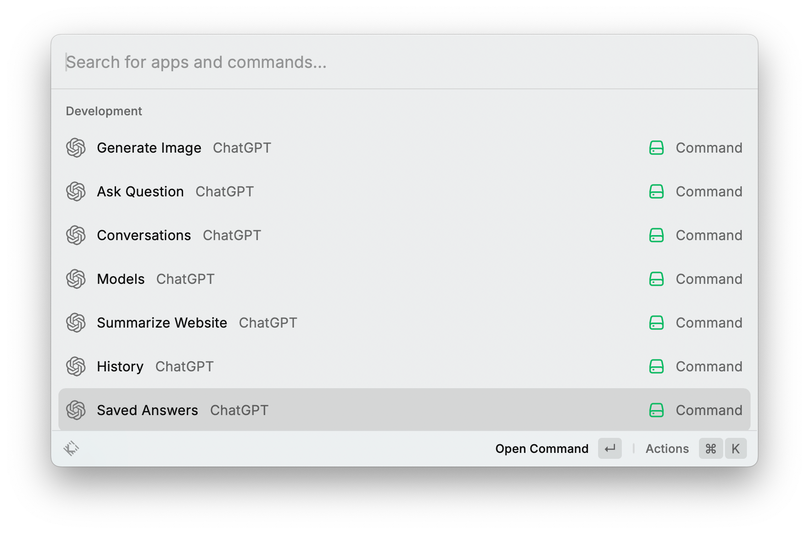
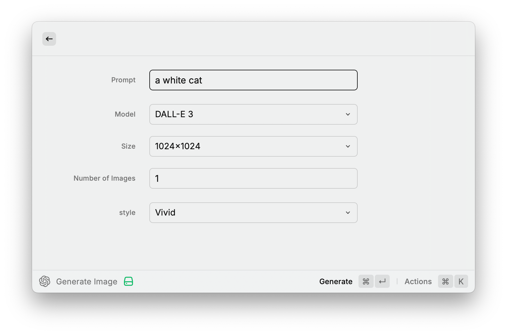
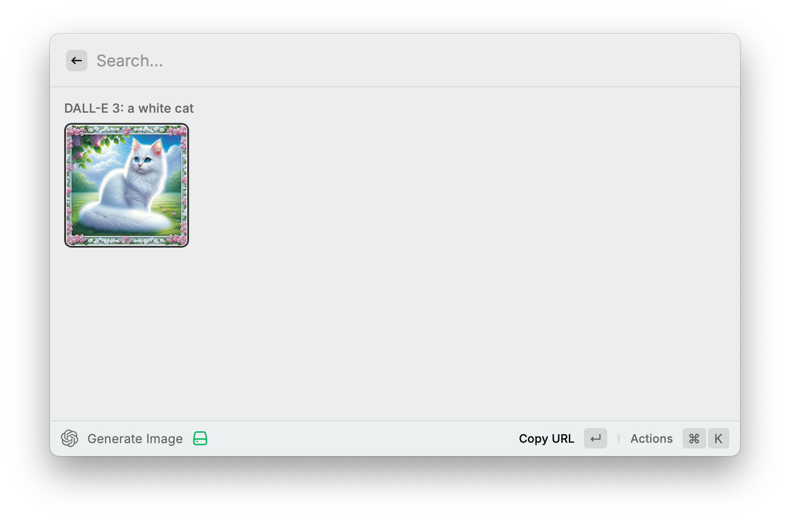
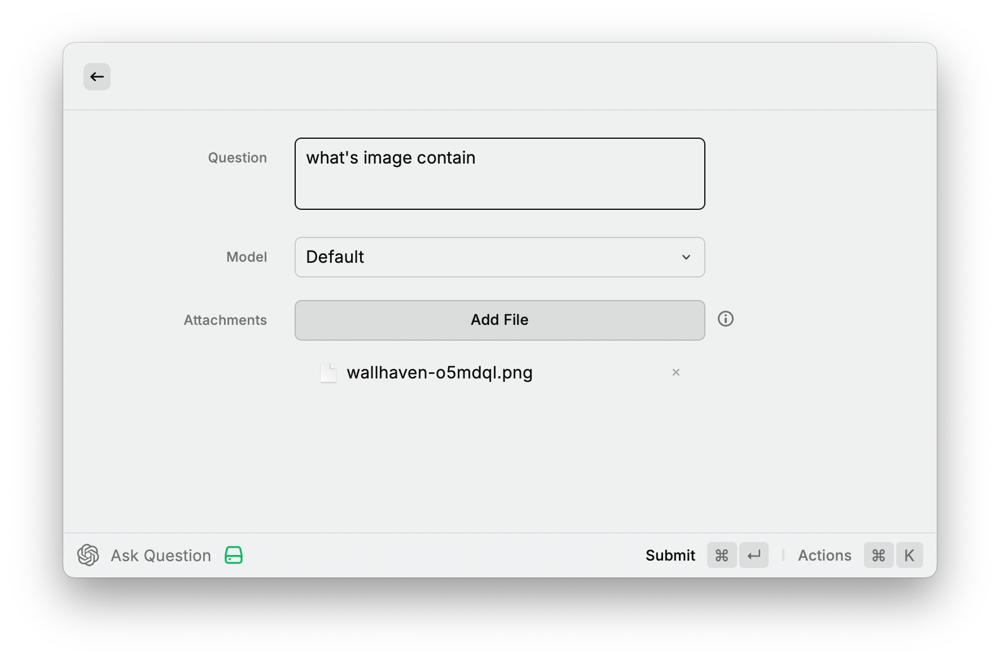
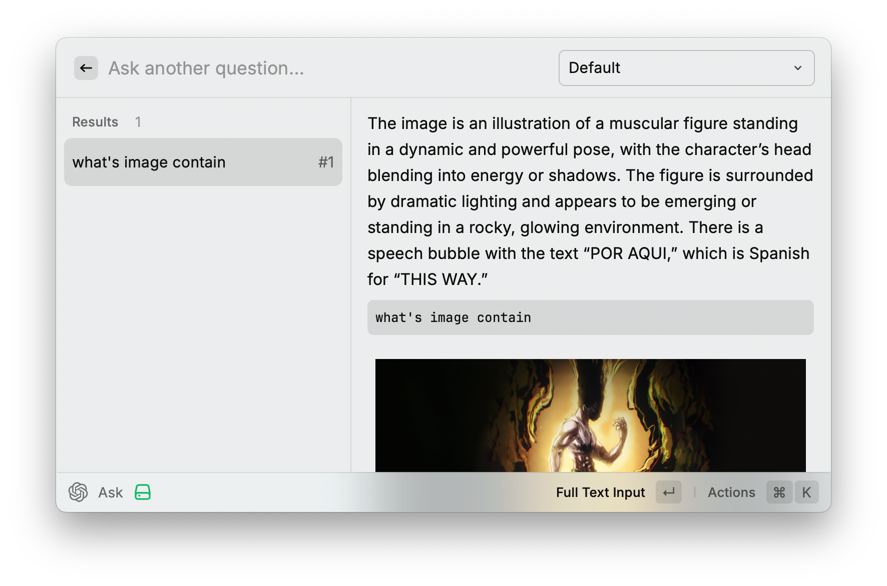
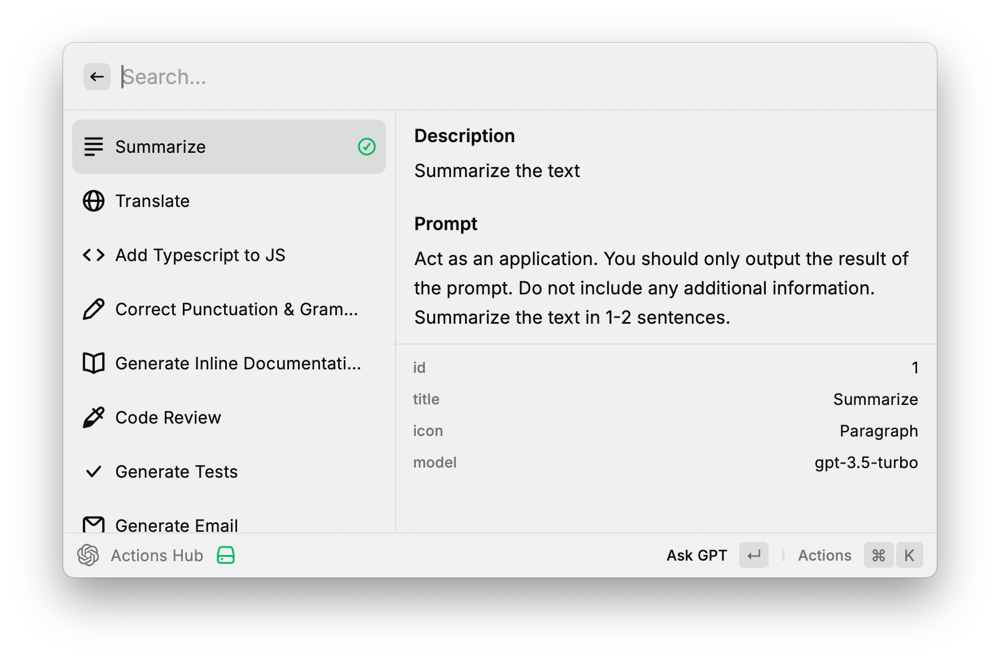

<picture>
  <source media="(prefers-color-scheme: dark)" srcset="./assets/icon@dark.png">
  <source media="(prefers-color-scheme: light)" srcset="./assets/icon.png">
  
</picture>

<h1 align="center">ChatGPT</h1>

This build for myself

### DALL·E

### Vision

### Actions Hub & Quick Action

## Installation

Currently, you need to clone this repo and install it locally in developer mode.

You will need to have [Node.js](https://nodejs.org) and [pnpm](https://pnpm.io/) installed.

1. Clone this repo `git clone https://github.com/bxb100/chatgpt.git`
2. Go to the folder `cd chatgpt`
3. Install dependencies `npm install`
4. Go to Raycast, run `Import Extension` and select the folder

## Support Provider

- [OpenAI](https://openai.com/)
- [Burn Hair](https://burn.hair/register?aff=FryM) / 头顶冒火
- [Cloudflare AI](https://ai.cloudflare.com/) but need
  using [openai-cf-workers-ai](https://github.com/chand1012/openai-cf-workers-ai) wrapper
- [Groq](https://console.groq.com/)
- [Ollama](https://ollama.com/blog/openai-compatibility)

## Others

- [PromptLab](https://github.com/SKaplanOfficial/Raycast-PromptLab) more elegant and powerful

- Due to the raycast memory limit(100Mb), so if you want using [tiktoken](https://github.com/openai/tiktoken), the only
  way is installing [tiktoken-cli](https://github.com/bxb100/tiktoken-cli)

---

> original written by [Abiel Zulio M](https://github.com/abielzulio) and published
> in [Raycast Store](https://www.raycast.com/abielzulio/chatgpt)
